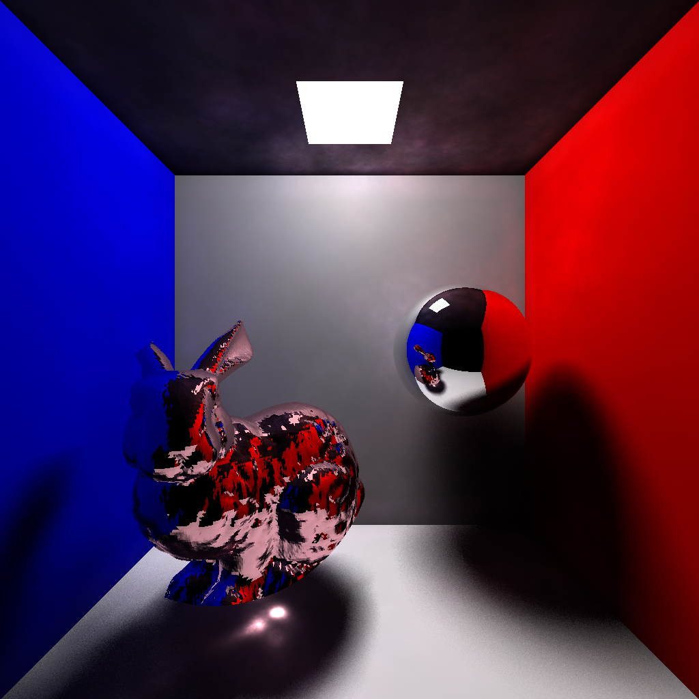

# Photon-Mapping
An implementation of photon mapping added to a basic raytracer to implement global lighting.

Features-
* Uses anti-aliasing.
* Uses soft shadows.
* Renders caustics (with seperate photon maps for caustics and global lighting). 
* Renders diffuse intereflection (e.g. red and blue lighting on the back walls).
* Implementation of a balanced KD-tree data structure.
* Implementation of a nearest neighbours algorithm (with KD tree) to find closest photons.
* Renders all L(D|S)\*E light paths

The final product can be seen below.

To build simply compile main.cpp with any C++ compiler, making sure to add the include directory to your include paths. 
